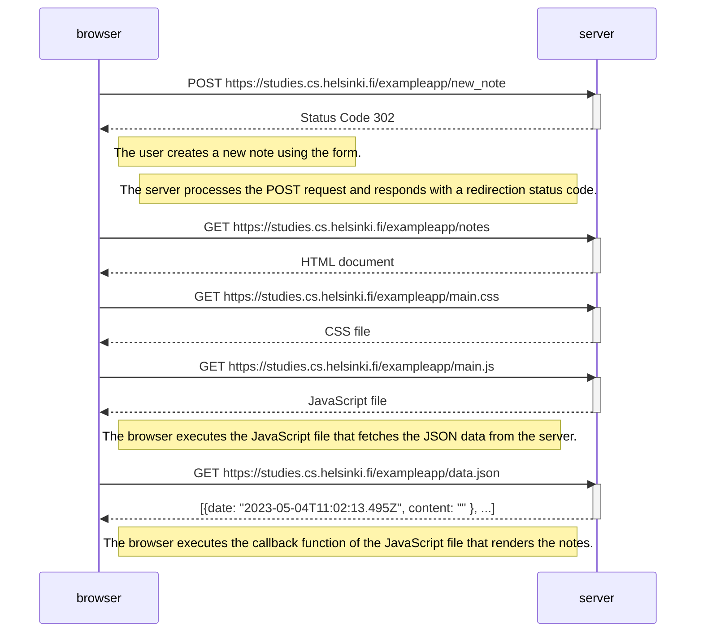

```mermaid
sequenceDiagram
    browser->>server: POST https://studies.cs.helsinki.fi/exampleapp/new_note
	activate server
	server-->>browser: Status Code 302
	deactivate server
	note right of browser: The user creates a new note using the form.
	note left of server: The server processes the POST request and responds with a redirection status code.

	browser->>server: GET https://studies.cs.helsinki.fi/exampleapp/notes
	activate server
	server-->>browser: HTML document
	deactivate server

	browser->>server: GET https://studies.cs.helsinki.fi/exampleapp/main.css
	activate server
	server-->>browser: CSS file
	deactivate server

	browser->>server: GET https://studies.cs.helsinki.fi/exampleapp/main.js
	activate server
	server-->>browser: JavaScript file
	deactivate server

	note right of browser: The browser executes the JavaScript file that fetches the JSON data from the server.

	browser->>server: GET https://studies.cs.helsinki.fi/exampleapp/data.json
	activate server
	server-->>browser: [{date: "2023-05-04T11:02:13.495Z", content: "" }, ...]
	deactivate server

	note right of browser: The browser executes the callback function of the JavaScript file that renders the notes.
```
