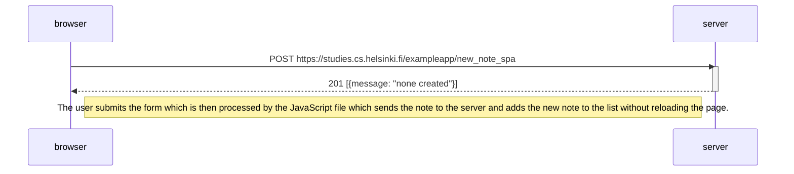

```mermaid
sequenceDiagram
    browser->>server: POST https://studies.cs.helsinki.fi/exampleapp/new_note_spa
	activate server
	server-->>browser: 201 [{message: "none created"}]
	deactivate server

	note right of browser: The user submits the form which is then processed by the JavaScript file which sends the note to the server and adds the new note to the list without reloading the page.
```
