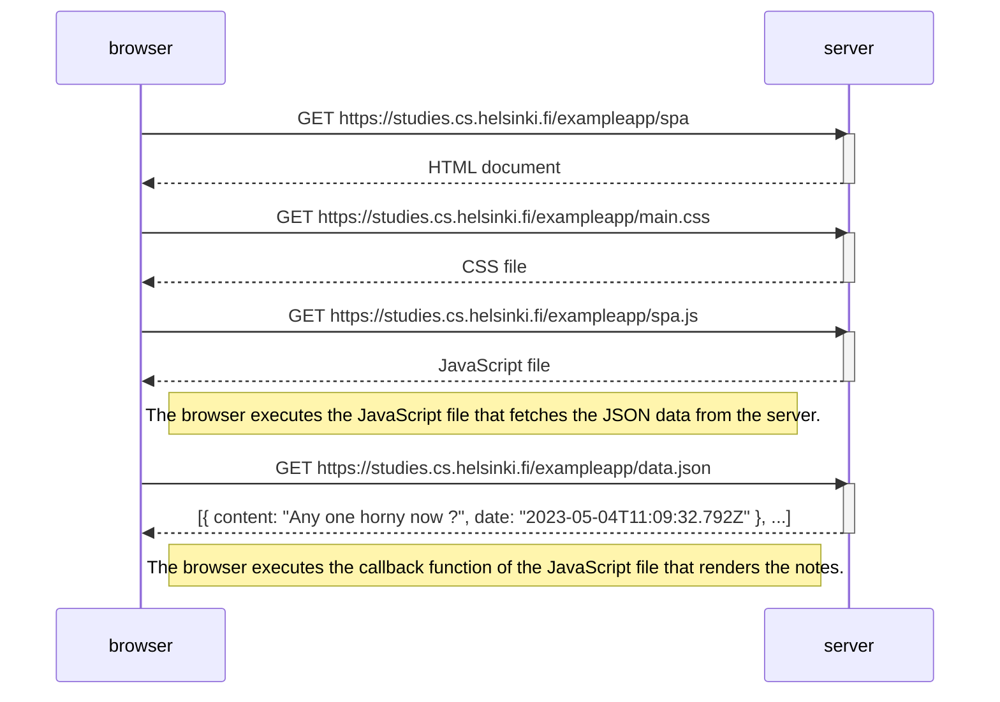

```mermaid
 sequenceDiagram
 	browser->>server: GET https://studies.cs.helsinki.fi/exampleapp/spa
	activate server
	server-->>browser: HTML document
	deactivate server

	browser->>server: GET https://studies.cs.helsinki.fi/exampleapp/main.css
	activate server
	server-->>browser: CSS file
	deactivate server

	browser->>server: GET https://studies.cs.helsinki.fi/exampleapp/spa.js
	activate server
	server-->>browser: JavaScript file
	deactivate server

	note right of browser: The browser executes the JavaScript file that fetches the JSON data from the server.

	browser->>server: GET https://studies.cs.helsinki.fi/exampleapp/data.json
	activate server
	server-->>browser: [{ content: "Any one horny now ?", date: "2023-05-04T11:09:32.792Z" }, ...]
	deactivate server

	note right of browser: The browser executes the callback function of the JavaScript file that renders the notes.
```
